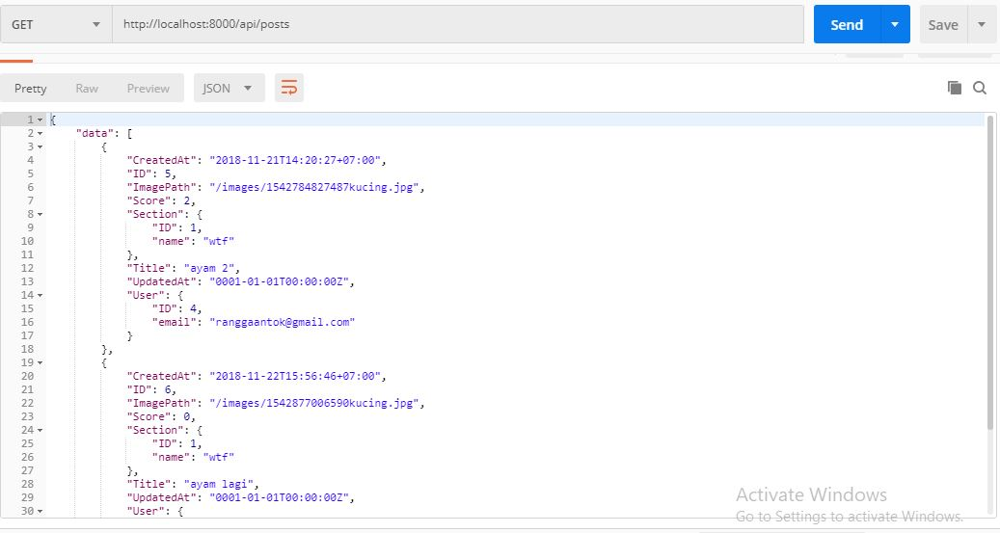
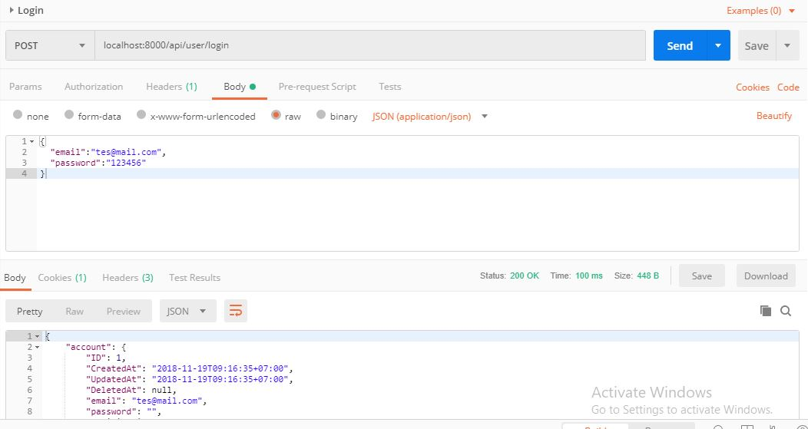

# golang-9gag-clone
Web Service Clone of 9GAG using GOlang and mySQL

1. JWT Authentication, Authorization
2. Create,Read, Delete Post and Comment
3. email Verification Login

**How to use**
1. complete the env file
2. run in console ```go run main.go```
3. fill the email and password on util.go file for email verificaion

the list of Postman request can find here!!!
[a link](https://documenter.getpostman.com/view/461666/RzfZQYnC)

**Request Example*



